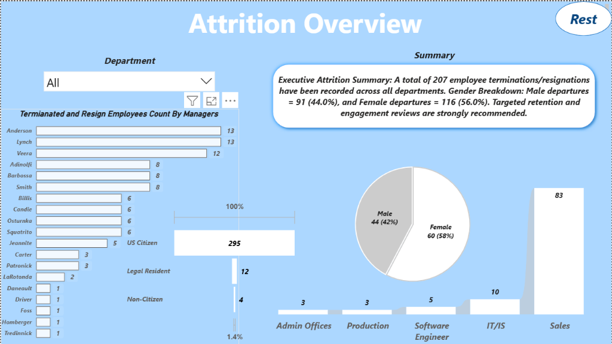
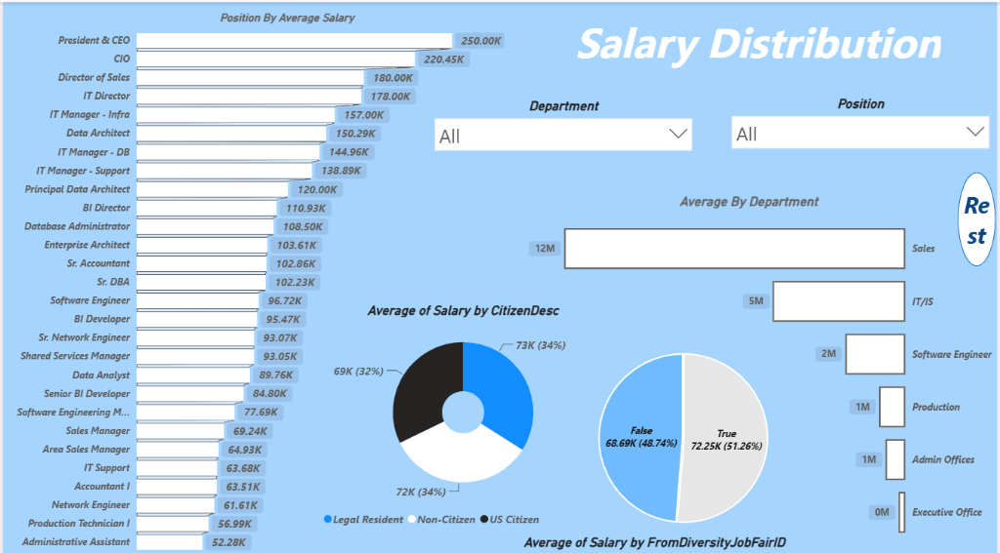
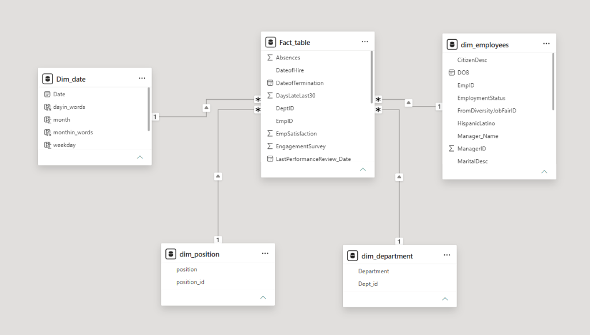

# HR Analytics: Attrition & Salary Insights

[](dashboard/hr_analytics_dashboard.pbix)
[](sql/)
[](docs/images/data_model_star_schema.png)
[](#)

An end-to-end HR analytics project combining SQL-driven ETL pipelines, star schema data modeling, and interactive Power BI dashboards to uncover critical workforce attrition drivers and compensation benchmarks.

---

## 📌 Problem Statement

The Human Resources leadership team required actionable intelligence on two strategic workforce challenges:

1. **Workforce Attrition Dynamics**: Identify departments, managers, and demographic segments experiencing the highest turnover (`Termd = 1`) and isolate underlying root causes.
2. **Compensation & Pay Equity Benchmarking**: Evaluate salary distributions across job roles, departments, citizenship statuses, and recruitment channels (e.g., Diversity Job Fairs) to identify pay gaps and optimize compensation budgeting.

*(Reference documentation: [docs/hr_analytics_request.pdf](docs/hr_analytics_request.pdf) and [docs/hr_analytics_report.pdf](docs/hr_analytics_report.pdf))*

---

## 💡 Key Business Insights & Analytical Findings

Beyond technical data pipelines, the exploratory and diagnostic analysis revealed critical findings for HR decision-makers:

### 1. Departmental Attrition Concentration
* **Sales Department High Turnover**: The Sales department accounted for the overwhelming majority of employee departures with **83 exits**, significantly outpacing **IT/IS (10)**, **Software Engineering (5)**, and **Production/Admin (3 each)**.
* **Operational Risk**: High churn in sales directly impacts revenue pipelines and customer acquisition costs, indicating an urgent need for sales incentive restructuring and quota realignment.

### 2. Manager-Level Turnover Disparities
* **Leadership Outliers**: Three managers accounted for over **18% of total recorded exits** — **Anderson (13)**, **Lynch (13)**, and **Veera (12)**, followed by **Adinolfi (8)**, **Barbossa (8)**, and **Smith (8)**.
* **Actionable Indicator**: The sharp concentration of exits under specific teams suggests managerial friction or workload imbalance rather than company-wide disengagement.

### 3. Demographic & Gender Turnover Breakdown
* **Gender Turnover Split**: Departures skewed towards female employees (**56.0% / 116 departures**) compared to male employees (**44.0% / 91 departures**).
* **Citizenship Stability**: The vast majority of the retained workforce are US Citizens (295), with Legal Residents (12) and Non-Citizens (4) showing lower overall headcount volumes.

### 4. Compensation & Diversity Fair Insights
* **Executive vs. Operational Salary Spread**: Executive salaries peak with President & CEO (**$250K**), CIO (**$220.45K**), and Director of Sales (**$180K**), while Production Technicians (**$56.99K**) and Administrative Assistants (**$52.28K**) represent the baseline.
* **Diversity Hiring Value**: Employees hired through Diversity Job Fairs earn a higher average compensation (**$72.25K / 51.3%**) compared to conventional recruitment channels (**$68.69K / 48.7%**), confirming strong talent quality and competitive placement.
* **Citizenship Pay Parity**: Average salary remains equitable across citizenship categories (**$73K Non-Citizen**, **$72K Legal Resident**, **$69K US Citizen**).

---

## 🎯 Strategic HR Recommendations

1. **Sales Retention Program**: Implement quarterly stay-interviews, re-evaluate sales commission structures, and establish onboarding buddy systems to reduce early sales burnout.
2. **Managerial Coaching & 360 Reviews**: Conduct leadership effectiveness reviews for teams reporting to high-attrition managers to improve engagement and psychological safety.
3. **Gender-Focused Retention Initiatives**: Launch mentorship circles and work-life flexibility assessments to address the higher departure rate observed among female professionals.
4. **Expand Diversity Recruitment**: Continue funding Diversity Job Fair channels, as candidates demonstrate strong performance and competitive role placements.

---

## 📊 Dashboard Showcase

### Page 1: Attrition Overview
Interactive monitoring of departmental attrition volumes, managerial exit rankings, gender distribution, and executive summary KPI cards.



---

### Page 2: Salary Distribution
Comprehensive salary benchmarking by role hierarchy, department payroll volume, citizenship status, and diversity sourcing channel.



---

## 🏗️ Data Architecture & Star Schema

The raw dataset was reshaped into an optimized dimensional star schema to ensure high-performance querying, clean relationship cardinality, and flexible cross-filtering in Power BI.



### Schema Breakdown

| Table | Type | Key Attributes / Role | SQL Source File |
| :--- | :--- | :--- | :--- |
| **`Fact_table`** | Fact | `EmpID`, `DeptID`, `DateofHire`, `DateofTermination`, `Absences`, `DaysLateLast30`, `EmpSatisfaction`, `EngagementSurvey`, `LastPerformanceReview_Date` | [`sql/fact_table.sql`](sql/fact_table.sql) |
| **`dim_employees`** | Dimension | `EmpID`, `CitizenDesc`, `DOB`, `EmploymentStatus`, `FromDiversityJobFairID`, `HispanicLatino`, `Manager_Name`, `ManagerID`, `MaritalDesc` | [`sql/employee_dim_table.sql`](sql/employee_dim_table.sql) |
| **`dim_department`** | Dimension | `Dept_id`, `Department` | [`sql/department_dim_table.sql`](sql/department_dim_table.sql) |
| **`dim_position`** | Dimension | `position_id`, `position` | [`sql/position_dim_table.sql`](sql/position_dim_table.sql) |
| **`Dim_date`** | Dimension | `Date`, `dayin_words`, `month`, `monthin_words`, `weekday` | [`sql/time_dim_table.sql`](sql/time_dim_table.sql) |

---

## 🛠️ ETL & Data Transformation Pipeline

1. **Data Ingestion**: Raw tabular data (`data/hr_dataset.csv` / `data/hr_dataset.xlsx`) containing 36+ columns of raw employee attributes.
2. **SQL Transformation**: Structured SQL transformations to:
   - Clean missing termination dates and standardize date dimensions.
   - Separate employee master attributes from transactional performance and attendance metrics.
   - Generate surrogate dimension keys and assign normalized department/position IDs.
3. **Model Integration**: Exported clean tables to Power BI, defining strict 1-to-many (`1:*`) relationships with bidirectional filtering where appropriate.

---

## 📁 Repository Structure

```
├── dashboard/
│   └── hr_analytics_dashboard.pbix    # Interactive Power BI dashboard report
├── data/
│   ├── hr_dataset.csv                 # Raw HR dataset (CSV format)
│   └── hr_dataset.xlsx                # Raw HR dataset (Excel format)
├── docs/
│   ├── images/
│   │   ├── attrition_overview_dashboard.png
│   │   ├── salary_distribution_dashboard.png
│   │   └── data_model_star_schema.png
│   ├── hr_analytics_report.pdf        # Formal executive summary report
│   └── hr_analytics_request.pdf       # Original business requirement brief
├── sql/
│   ├── fact_table.sql                 # Fact table extraction & transformation
│   ├── employee_dim_table.sql         # Employee dimension transformation
│   ├── department_dim_table.sql       # Department dimension transformation
│   ├── position_dim_table.sql         # Position dimension transformation
│   └── time_dim_table.sql             # Date/Calendar dimension generator
└── README.md                          # Project documentation and insights
```

---

## 🚀 How to Open & Explore

1. **Clone the Repository**:
   ```bash
   git clone https://github.com/santhoshkumarp8205/HR-Analytics-Attrition-Salary-Insights.git
   ```
2. **View SQL Scripts**:
   - Navigate to [`sql/`](sql/) to review table schemas and transformation scripts.
3. **Open the Power BI Dashboard**:
   - Download and open [`dashboard/hr_analytics_dashboard.pbix`](dashboard/hr_analytics_dashboard.pbix) using [Power BI Desktop](https://powerbi.microsoft.com/desktop/).
